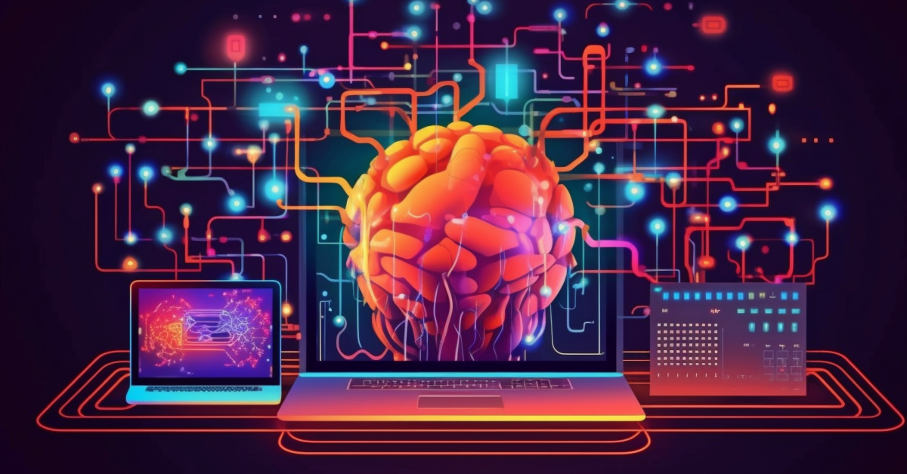

# Deep Learning 00

This repository contains my implementations of deep learning models and experiments. It serves as a collection of code and updates related to deep learning projects I'm working on.

## Table of Contents

- [Introduction](#introduction)
- [Installation](#installation)

## Introduction

In this repository, I explore various deep learning architectures, algorithms, and techniques. The code provided here demonstrates my understanding and implementation of deep learning models for different tasks, such as image classification, natural language processing, and generative models.

## Installation

To use the code in this repository, you need to have the following dependencies installed:

- Python (version X.X)
- Deep learning libraries (e.g., TensorFlow, PyTorch)
- Additional libraries (NumPy, Matplotlib, etc.)
